# 🚀 Task 2: Conversational Knowledge Bot (LangChain + Tools + Memory)

A powerful local Streamlit chat application built with **LangChain** and **Groq**, featuring a multi-tool agent that intelligently selects between Google Search (Serper), Wikipedia, Document RAG, and Memory to recall conversation context.

## 🌟 Features

- 🤖 **Multi-Tool Agent**: Automatically selects the best tool or follows your manual selection
- 🔍 **Smart Web Search**: Integrated **Serper API (Google Search)** for high-quality, up-to-date results
- 📚 **Wikipedia Integration**: Encyclopedic knowledge for deep dives into concepts and history
- 📄 **Document RAG**: Upload and chat with your own documents (PDF, TXT, MD)
- 🧠 **Persistent Memory**: Remembers your conversation context and follows up on previous topics
- ⚡ **Powered by Groq**: Blazing fast responses using the Llama 3 70B model
- ⚙️ **Dual Control**: Let the AI decide (Auto) or manually force a specific tool via the sidebar settings

## 🔄 Agent Workflow

```mermaid
graph TD
    A[🧑 User Query] --> B{🤖 Agent Analysis}
    B -->|Auto Mode| C{Select Tool?}
    B -->|Manual Mode| D[Force Selected Tool]
    
    C -->|Current Fact| E[🔍 Serper Web Search]
    C -->|Concept/History| F[📚 Wikipedia]
    C -->|User Doc| G[📄 RAG Search]
    C -->|Context| H[🧠 Memory Query]
    
    D --> E
    D --> F
    D --> G
    
    E --> I[📝 Synthesis]
    F --> I
    G --> I
    H --> I
    
    I --> J[✅ Final Response]
```



## 📸 Demo

### 1. Overall Chat Interface

*The clean, modern chat interface with sidebar controls.*

### 2. Web Search Results (Serper)

*Asking about current events triggers the Serper tool for Google-based results.*

### 3. Context Retention

*The bot remembers previous context to answer follow-up questions.*

### 4. Wikipedia Search

*Deep dives into concepts uses the Wikipedia tool.*

### 5. Document Search (RAG)

*Upload documents and ask specific questions about their content.*

## 🛠️ Setup Guide

### 1. Clone and Navigate
```bash
git clone https://github.com/suryansh-sr-17/soulpage-genai-task2-suryanshsr.git
cd conv-knowledge-bot
```

### 2. Create Virtual Environment
```bash
python -m venv venv
# Windows:
venv\Scripts\activate
# Mac/Linux:
source venv/bin/activate
```

### 3. Install Dependencies
```bash
pip install -r requirements.txt
```

### 4. Configure Environment
Create a `.env` file and add your API keys:

```bash
cp .env.example .env
```

**Required Configuration:**
```env
# Groq API Key (for LLM)
# Get from: https://console.groq.com/
GROQ_API_KEY=your_groq_api_key_here

# Serper API Key (for Google Search)
# Get from: https://serper.dev/
SERPER_API_KEY=your_serper_api_key_here
```

### 5. Run the Application
```bash
streamlit run app/main.py
```
Visit `http://localhost:8501` in your browser.

## 📖 Usage

### Tool Selection Modes
You can control how the bot selects tools in the sidebar:
- **Auto (Default)**: The AI intelligently decides which tool to use based on your query.
- **Manual Override**: Force the bot to use **Web Search**, **Wikipedia**, or **Document Search** for specific needs.

### Document Q&A
1. Upload your PDF/TXT files in the sidebar.
2. The bot ingests them into the vector store.
3. Ask questions like "What does the document say about X?".

## 🏗️ Project Structure
```
conv-knowledge-bot/
├── app/
│   ├── main.py              # Streamlit UI entry point
│   └── ui_helpers.py        # Sidebar & rendering logic
├── src/
│   ├── agent.py             # LangChain agent orchestration
│   ├── llm_providers.py     # Groq provider implementation
│   ├── tools/
│   │   ├── serper_tool.py   # Google Search (Serper)
│   │   ├── wiki_tool.py     # Wikipedia
│   │   └── rag_tool.py      # Document RAG
│   └── memory.py            # Conversation persistence
├── data/                    # Local storage (memory, vectors)
└── requirements.txt         # Dependencies
```

## 🤝 Contributing
Contributions are welcome! Please ensure you have your API keys set up for testing.

## 📄 License
MIT License
